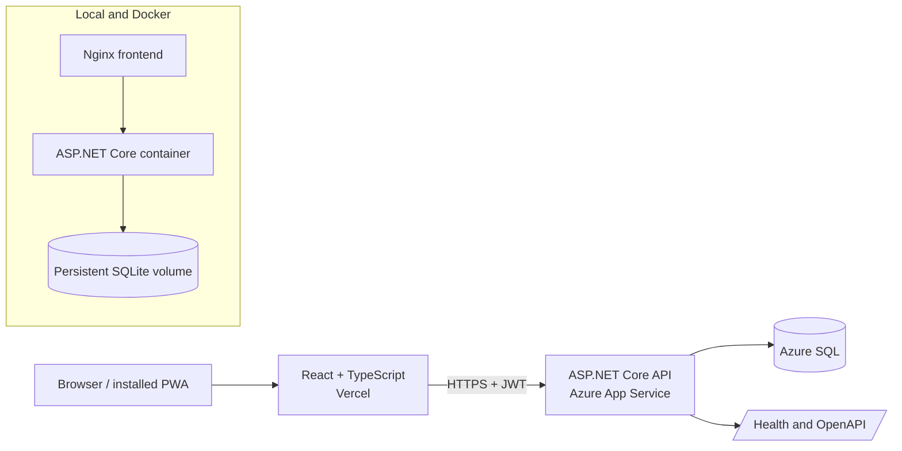

# Sleepy Koala

[](https://github.com/LishaYUJ/Sleepy-koala/actions/workflows/ci.yml)

Sleepy Koala is a production-deployed bedtime habit application built around a deceptively difficult problem: turning local bedtime behaviour into consistent, private, and recoverable daily records.

Users set a bedtime goal, check in before sleep, and care for a koala whose energy reflects recent consistency. Streaks, badges, weekly history, and a privacy-conscious leaderboard make progress visible without turning missed nights into punishment.

**[Open the live application](https://my-sleepy-koala.vercel.app)** · **[API health](https://sleepy-koala-lisa.azurewebsites.net/health)** · **[API documentation](https://sleepy-koala-lisa.azurewebsites.net/scalar/v1)**


## What makes the project technically interesting

### Recoverable registration under ambiguous failures

A production registration incident exposed a subtle failure mode: Azure could cold-start or return a transient platform response while the browser reported only `Failed to fetch`. That message could not prove whether the registration had failed before reaching the API or succeeded in the database before its response was interrupted.

The repair treats registration as a recoverable operation rather than blindly retrying a `POST`:

1. The client assigns one stable `registrationAttemptId` to the logical registration.
2. Transient network, CORS, `502`, `503`, and `504` failures use bounded retries with the same ID.
3. A unique database index prevents two concurrent requests from creating two users for one attempt.
4. Replaying the same ID and matching details returns the original account with a fresh token.
5. Reusing an ID with different details is rejected, and email uniqueness remains the fallback after a page reload.

This preserves a consistent user outcome even when the client cannot know whether the first response was lost before or after the database commit. The investigation, rollout, migration, verification, and remaining risks are recorded in [the maintenance log](docs/maintenance-log.md) and [the reliability notes](docs/registration-reliability-notes.md).

### A domain model for sleep days, not calendar days

Bedtime activity crosses midnight, so an ordinary calendar-date model produces misleading history. Sleepy Koala assigns activity between midnight and 02:00 to the previous evening's sleep date, then evaluates it against the user's local bedtime and timezone.

The model also distinguishes real records from inferred absence:

- real on-time and late check-ins remain durable history;
- newly registered users do not begin with an unexplained missed night;
- legacy accounts derive a fair tracking start when older data lacks one;
- missing nights are inferred for at most seven consecutive days, then pause until the next real check-in.

These rules are implemented in a dedicated calendar service and covered by boundary-focused tests rather than being spread through UI components.

### Privacy and security as application behaviour

- Passwords are hashed with BCrypt and never stored in plaintext.
- JWT-protected endpoints derive the user ID from validated claims instead of accepting an arbitrary client-supplied ID.
- Detailed check-in history remains private; the leaderboard exposes only nickname and streak.
- Avatar uploads are checked for MIME type, file signature, Base64 validity, and decoded size.
- CORS is restricted to the production frontend origin.
- Account deletion removes the authenticated user's related private records.

## Product experience

- Animated koala states reflect healthy, weak, very weak, preparing-for-bed, and sleeping conditions.
- A ten-heart energy model translates recent late or missed sleep days into immediate feedback.
- Weekly history explains the state shown by the koala instead of presenting an unexplained score.
- Streaks and milestone badges reward consistency.
- Responsive desktop, mobile, and installable PWA layouts keep the bedtime sanctuary as the main experience.
- Profile settings include nickname, avatar, timezone, bedtime goal, and account deletion.

## Architecture



| Layer | Implementation |
| --- | --- |
| Frontend | React, TypeScript, Vite, Zustand, React Router |
| Backend | ASP.NET Core, Entity Framework Core, JWT authentication |
| Production data | Azure SQL |
| Local and Docker data | SQLite |
| Delivery | Vercel, Azure App Service, Docker Compose, GitHub Actions |
| Verification | Vitest, Testing Library, xUnit, ASP.NET Core integration tests |

The frontend and backend deploy independently. Vercel receives the API base URL through `VITE_API_BASE_URL`; Azure receives database, JWT, and allowed-origin configuration through App Service settings. Local Vite development proxies `/api`, while Docker uses Nginx to provide the same-origin path.

## Verification

The current test suite contains:

- **74 frontend tests** covering state transitions, authentication recovery, component behaviour, energy calculations, and history presentation;
- **47 backend tests** covering authentication, authorization, idempotency, CORS, API integration, check-in rules, and sleep-day boundaries.

GitHub Actions builds and tests the frontend and backend on every pull request and push to `main`.

Run the same checks locally:

```bash
cd frontend
npm ci
npm run build
npm test -- --run
npm run lint

cd ..
dotnet test tests/SleepyKoala.Tests.csproj
```

## Run the complete stack with Docker

Requirements: Docker Desktop with Docker Compose.

```bash
cp .env.example .env
# Replace JWT_KEY in .env with a random secret of at least 32 bytes.
docker compose up --build
```

Open [http://localhost:3000](http://localhost:3000), then inspect container health with:

```bash
docker compose ps
```

The Compose stack builds the frontend and backend separately, waits for a healthy API, applies Entity Framework migrations when configured, and persists SQLite data in a named volume.

To stop it without deleting local data:

```bash
docker compose down
```

## Run without Docker

Start the API:

```bash
dotnet run --project backend/SleepyKoala.Api.csproj
```

Start the frontend in a second terminal:

```bash
cd frontend
npm ci
npm run dev
```

See [DEPLOYMENT.md](DEPLOYMENT.md) for the Azure and Vercel configuration.

## Engineering trade-offs and next steps

The application is intentionally sized for a low-traffic personal product rather than pretending to require enterprise high availability.

- Azure cold starts are tolerated to control cost; safe recovery and idempotency protect the operations that could cause user harm.
- `/health` currently proves application liveness more directly than full database readiness. A separate readiness check would be the next operational improvement.
- The backend is deployed separately from the automatically deployed Vercel frontend. A versioned backend delivery pipeline would reduce deployment mismatch risk.
- Several large illustration assets should be converted to modern formats and loaded by route to reduce initial transfer size.
- Centralised error monitoring would become worthwhile if the application gained regular external users.

## AI-assisted engineering

AI was used across planning, UI iteration, implementation, debugging, test design, migration review, Docker configuration, and production investigation. Suggestions were not accepted as evidence by themselves: changes were checked against the running application, automated tests, rendered UI, database schema, deployment responses, and live HTTP behaviour.

Prompt summaries and outcomes are recorded in [specs/ai-prompts.md](specs/ai-prompts.md); the constraints supplied to the coding agent are recorded in [specs/agent-instructions.md](specs/agent-instructions.md).

## Additional documentation

- [Production maintenance log](docs/maintenance-log.md)
- [Registration reliability notes](docs/registration-reliability-notes.md)
- [Deployment configuration](DEPLOYMENT.md)
- [Assessment evidence](docs/assessment-evidence.md)
- [API design](specs/api-design.md)
- [Data model](specs/data-model.md)
- [Product decisions](specs/design-decisions.md)
